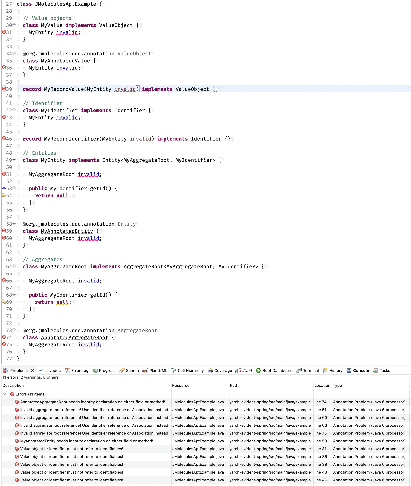

= jMolecules APT Processor

The jMolecules APT (Annotation Processing Tool) Processor verifies rules attached to jMolecules concepts during compilation, without the need for any third-party tooling integration.
To activate the compiler extension, include the following dependencies in your project:

[source, xml]
----
<dependency>
  <groupId>org.jmolecules</groupId>
  <artifactId>jmolecules-ddd</artifactId>
</dependency>

<dependency>
  <groupId>org.jmolecules.integrations</groupId>
  <artifactId>jmolecules-apt</artifactId>
  <scope>provided</scope>
</dependency>
----

TIP: Use the https://github.com/xmolecules/jmolecules-bom?tab=readme-ov-file#jmolecules-bom[jMolecules BOM] to avoid having to explicitly declare dependency versions for each artifact individually.

Violations detected will be immediately displayed in your IDE upon compilation, or on your command line after build execution.

